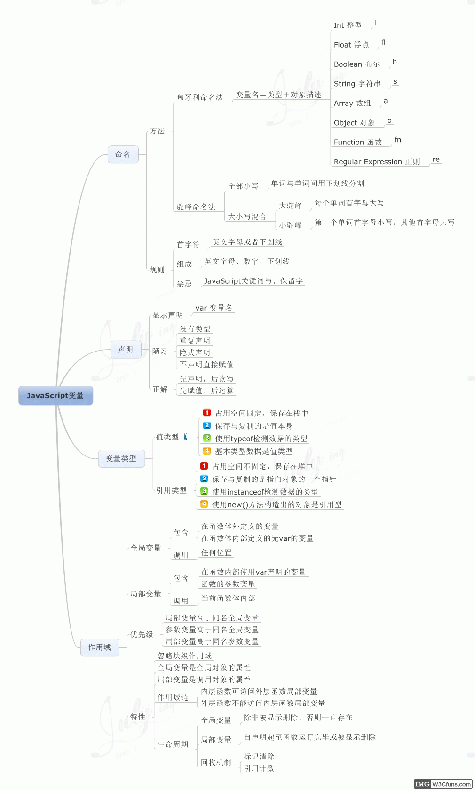
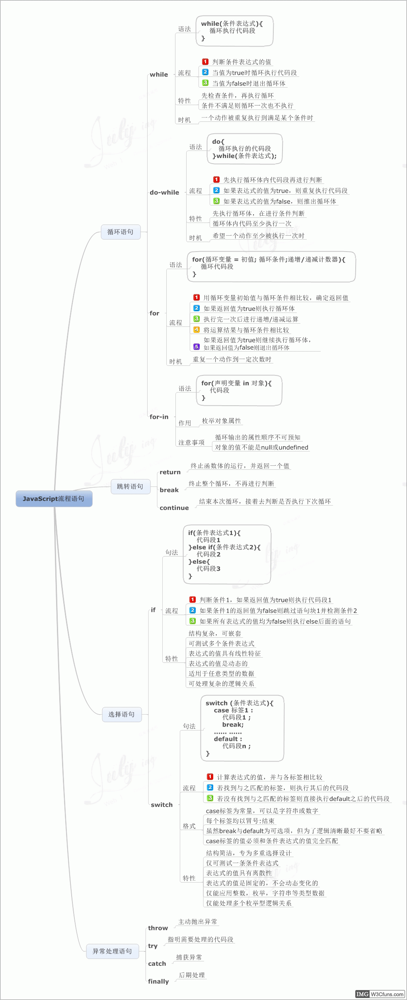

### JavaScript DOM基本操作

### JavaScript变量

### JavaScript函数基础

### JavaScript流程语句

### JavaScript数据类型

### JavaScript数组

### JavaScript运算符

### JavaScript正则表达式

### JavaScript字符串

### Window对象

> 摘自https://www.qdfuns.com/article/16115/2949efbf88d86f01fe4fadab65c47dd6.html

